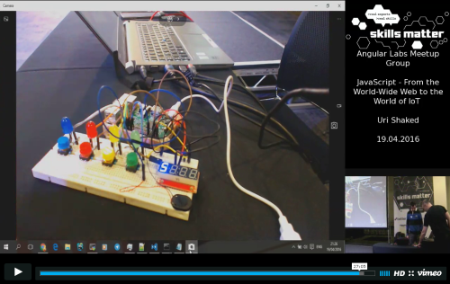

# Angular 2 IoT
> IoT support for Angular 2

Angular 2 IoT is an experimental technology that allows you to program physical hardware (buttons, LEDs, etc.) 
using Angular 2. It provides a set of directives, such as `<iot-button>` and `<iot-led>` that let you interface
with the hardware. It is even possible to create an application that renders both a Web interface and an IoT (hardware) 
interface with a single code base. See [ng2-simon](https://github.com/urish/ng2-simon) for an example.

Behind the scenes, it uses a combination of [angular-universal](https://github.com/angular/universal) for running
the application inside Node.js, and the [johnny-five](https://github.com/rwaldron/johnny-five) library for 
interfacing with the hardware.  

# Building & Running the Blink example

## Arduino

The [Blink Example](https://github.com/urish/angular2-iot/blob/master/examples/blink.ts) will blink the built-in 
LED on an Adruino board that is connected to your PC. You will need to upload the 
[StandardFirmata firmware](https://github.com/firmata/arduino) to your Arduino board first. 

    git clone https://github.com/urish/angular2-iot
    cd angular2-iot
    npm install
    npm run example:build
    npm run example:run
    
Note: The example program will try to detect the serial port that the Arduino 
is connected to automatically. You can manually specify the port name by 
setting the `SERIAL_PORT` environment variable prior to running the example.

## C.H.I.P. (9$ computer)

[CHIP](https://www.getchip.com) is a tiny 9$ computer that has enough computing power to run Angular 2. 
It also has WiFi and Bluetooth built-in, which makes it an ideal IoT platform. There is a version of the [Blink
Example](examples/blink-chip.ts) that runs on CHIP. In order to run it, make sure you have Node 6.x installed on
your CHIP (you can install it via [nvm](https://github.com/creationix/nvm)), and the run the following commands:

    git clone https://github.com/urish/angular2-iot
    cd angular2-iot
    npm install
    npm install chip-io
    npm run example:build
    npm run example:chip

The on-board Status LED should start blinking.

# Presentation (April 2016)

Check out [ng2-simon](https://github.com/urish/ng2-simon) for a complete example of using angular2-iot for powering a game
that can be run both inside the web browser and on real hardware.

# License

